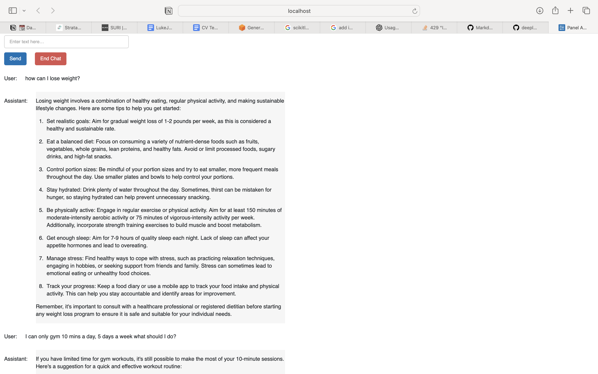

# ChatGPT Prompt Engineering for Developers 

I followed the tutorials from [DeepLearning AI's course](https://www.deeplearning.ai/short-courses/chatgpt-prompt-engineering-for-developers/) to find best practices and explanations / advice on prompt engineering for developers.

As a result I created a health and wellbeing chatbot in lesson 8, which can be found in [l8-chatbot.py](https://www.github.com/lukejbyrne/deeplearning.ai-chatgpt-prompt-engineering-for-beginners/blob/main/l8-chatbot.py)

Example use of the basic app can be found here:

